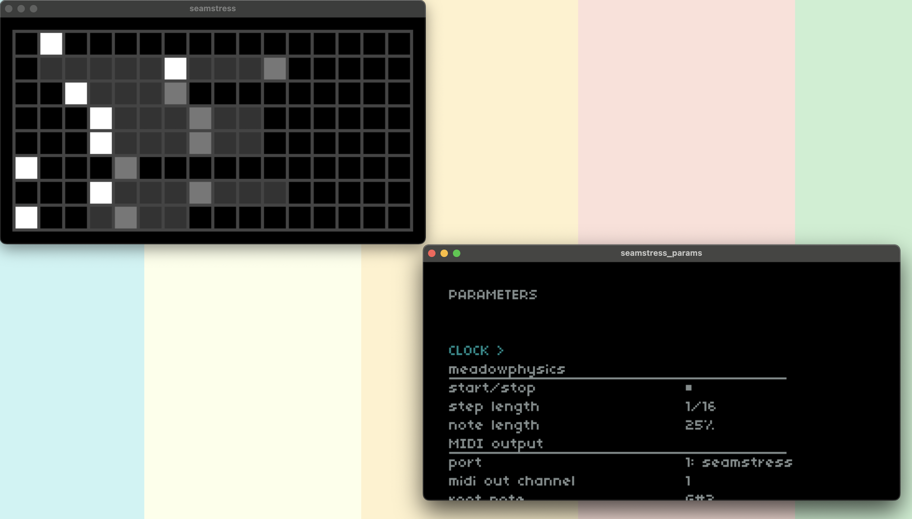

# meadowphysics: seamstress

## documentation

The seamstress version of meadowphysics is based off of the original module code and should have all expected features. See the original documentation for playability instructions:

- [https://monome.org/docs/modular/meadowphysics/]()  
- [https://monome.org/docs/modular/ansible/]()

### parameters

#### meadowphysics

**start/stop**

- `toggle`-style parameter (right-arrow)
- turns counting on and off
- resets counters when toggled
- also called with external transport start/stop messages

**step length**

- sets the base counter rate
- ranges from 64th notes to 1 bar (4/4)

**note length**

- when a voice is in trigger mode, determines the length of the played note
- ranges from 25% to 100% of the step length

#### MIDI output

**port**

- set the outgoing MIDI port
- displays all MIDI devices connected + present at script load

**midi out channel**

- set the MIDI output channel
- ranges from 1 to 16

**root note**

- set the root note of the scale
- global scales are added _to_ this value, so their data remains independent of the root note

**save global scales**

- `trigger`-style parameter (right-arrow)
- saves a `gridscales.data` file inside of the `<seamstress_path>/data/meadowphysics` folder -- see [below](#saving--loading) for more details

### keyboard + mouse interactions

seamstress uniquely offers keyboard and mouse interactions with the main window.

When the cascading counters are shown:

- mouse left-click: set the counter start
- <kbd>TAB</kbd>: toggle between cascading counters and scale page

When the scale page is shown:

- mouse left-click: focus on variable
- mouse wheel: increment / decrement focused variable
- <kbd>UP ARROW</kbd> / <kbd>DOWN ARROW</kbd>: cycle focus through variables within selected group
- <kbd>LEFT ARROW</kbd> / <kbd>RIGHT ARROW</kbd>: increment / decrement focused variable
- <kbd>ESC</kbd>: de-focus selected variable
- <kbd>TAB</kbd>: toggle between cascading counters and scale page

### saving + loading state

Using the PSET system that seamstress provides (run `seamstress -e hello_psets` for instruction), state data is saved to and recalled from a `meadowphysics` folder in your seamstress `data` path. To see your path, execute `path.seamstress` on the command line while seamstress is running.

Following the practice of the hardware modules, scale data is global -- each PSET reads/writes scale data to/from the same `gridscales.data` file inside of the `<seamstress_path>/data/meadowphysics` folder. This allows you to root many cascading counter explorations in the same custom scales.

## credits

meadowphysics was designed and written by [@tehn](https://github.com/tehn) (monome), originally a [max patch](https://github.com/monome/monome-max-package/blob/main/javascript/mp.js) and then a [module](https://github.com/monome/meadowphysics) and later into [another module](https://github.com/monome/ansible).

[@dndrks](https://github.com/dndrks) created this version for [seamstress](https://github.com/ryleelyman/seamstress), which is adapted and extended from the [norns version](https://github.com/alpha-cactus/meadowphysics).
